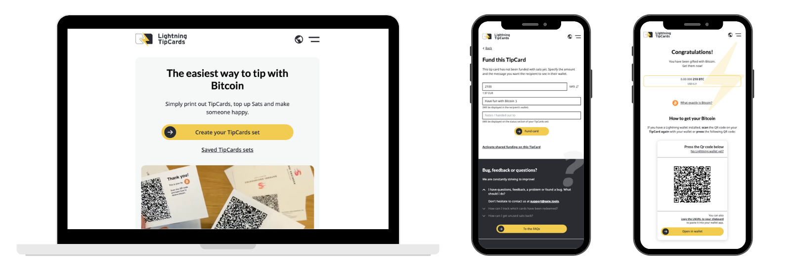

# ⚡️ Lightning TipCards

_by [#sathoshiengineeringcrew](https://satoshiengineering.com/)_

[](LICENSE)



## A tip card system based on LNbits and the lightning network

Lightning TipCards are a tip (or gift) card system, where you can fund tip cards via the lightning network
and the gifted person can redeem the funded cards. The gifted person gets a short introduction to bitcoin and a lightning
app recommendation to start their journey into the bitcoin rabbit hole.

It is an open-source project developed and operated for the benefit of the Bitcoin community,
with a focus on "How to gentle orange pill nocoiners" - and without warranty of any kind.

[LNbits](https://github.com/lnbits/lnbits) is used for the wallet and lightning payments in the background.

### Explanation Videos

- Youtube: [How to use lightning tip cards - DE](https://youtu.be/26dj0580HYc)
- Youtube: [How to use lightning tip cards - EN](https://youtu.be/bFeEPbupdx8)
- Youtube: [How to create your set of lightning tip cards - DE](https://youtu.be/Oq__BT6oVoM)
- Youtube: [How to create your set of lightning tip cards - EN](https://youtu.be/R6p7fUKu4MY)

`#satohsiengineeringcrew` is `#happy2help`

## Host your own TipCards

[Install guide](docs/setup.md)

## Setup for development

- [Development Guidelines](docs/guidelines.md)

### Prerequisites

- [nodejs 16.18.0 LTS](https://nodejs.org/en/)
- npm
- docker (recommended for redis setup, see below)

### Setup

```bash
npm install
```

If you are working at Satoshi Engineering, please configure your GIT repo to use the GIT hooks from  the directory `.githooks`:

```bash
git config core.hooksPath .githooks
```

### Backend

- Setup a postgres database (locally or remote doesn't matter)
- Create your own wallet on https://demo.lnbits.com/ or set your preferred lnbits instance via the env variable `LNBITS_ORIGIN` in `backend/.env.local` (see below).
- Create a `backend/.env.local` file (or copy it from `backend/.env`) and configure database and lnbits connection
- Additional configuration options are described in `backend/.env` (do not change it directly, copy the things you want to `backend/.env.local` and change them there).

#### Integration Test Env File

Per default the backend loads the `backend/.env` and `backend/.env.local` files. If you need to start the backend for integration tests you have can use a different env file. Run the backend using `npm run backend-dev -- --envIntegrationTest` which will also use the file `backend/.env.integrationTest`. You can also add the parameter to all other commands (cli, drizzle-migration, etc.).

#### Integration Test Script

You can run backend integration tests locally, including starting the local backend, in one command by running the helper script `./backend-integration-tests.sh`. This command uses the `backend/.env.integrationTest` env file (see Integration Test Env File).

Alternately, if you want to run specific tests, you could do:

```bash
# create custom env file for testing + startup backend using it
vi backend/.env.integrationTest
npm run backend-dev -- --envIntegrationTest

# run a specific test using .env.integrationTest
npm run backend-test-one-integration-route ./backend/tests/integration/your/custom/test.ts
```

### Frontend

- Create a `frontend/.env.local` file  (or copy it from `frontend/.env`)  and add the following variable:
  - `VITE_BACKEND_API_ORIGIN` probably http://localhost:4000 -> where your frontend will be served

### Testing

If you want to test the tipcards on your local machine, here are some hints:

- Fund your https://demo.lnbits.com/wallet with 1 - 100sats. The tipcard redeeming creates a lightning invoice 
via lnbits and there are transaction costs.
- It won't work with your smartphone, because the development setup restricted to localhost. (And if you use `vite --host` to expose the port,
your lightning apps will refuse to work because there is no ssl connection)
  - We use BlueWallet Deskop app for testing (it can access localhost)

## Tools

### VSCode

#### Recommended Extensions

- [Vue - Official](https://marketplace.visualstudio.com/items?itemName=vue.volar)
- [PostCSS Language Support](https://marketplace.visualstudio.com/items?itemName=csstools.postcss)
- [Tailwind CSS IntelliSense](https://marketplace.visualstudio.com/items?itemName=bradlc.vscode-tailwindcss)
- [ESLint](https://marketplace.visualstudio.com/items?itemName=dbaeumer.vscode-eslint)

### Ngrok

Ngrok is used to expose you local environment to the web. This is needed to test auth/backend features with your phone (e.g. paying invoices, logging in via lnurl-auth).

1. Copy backend/.env into backend/.env.local
2. Go to https://ngrok.com and create an account
3. Go to https://dashboard.ngrok.com/get-started/setup, copy your authtoken and add it to backend/.env.local

#### All in one script

This will serve the project under a single publicly visible endpoint, using a local express proxy to map frontend and backend.

Run `./dev-tip-cards.sh` and after it finishes copy the displayed ngrok url to your browser.

#### Set up manually using local proxy

This is the same as above, just done manually.

- Run `npm run backend-proxy`. This starts an express server that proxies all requests to your other services that we will start later.
- Run `npm run backend-ngrok`. Then copy the ngrok url that will be pasted in the console (something like https://cdb6-62-178-206-224.ngrok.io).
- Open backend/.env.local and set the ngrok url (from the previous point) for `NGROK_OVERRIDE` as this is now your public URL for your phone and lnbits webhooks.
- Open frontend/.env.local and set `VITE_NGROK_OVERRIDE=` to the ngrok endpoint
- Run `npm run backend-dev`
- Run `npm run frontend-dev`

#### Set up ngrok without using a local proxy

This will serve the frontend and backend with different endpoints (therefore auth will have to use third-party-cookies), but as the local express proxy is not an ideal setup this can improve page speed.

- Set up an ngrok.yml for mapping all the necessary ports, e.g.:

```yml
version: 3

agent:
  authtoken: your_auth_token

tunnels:
  frontend:
    proto: http
    addr: 5173
  backend:
    proto: http
    addr: 4000
  lnurl:
    proto: http
    addr: 4001

```

- Start ngrok: `ngrok start --config ngrok.yml --all`
- Update `backend/.env.local`, e.g.:

```sh
TIPCARDS_ORIGIN=https://5a9f99285ea2.ngrok.app
TIPCARDS_API_ORIGIN=https://825015a6ed5e.ngrok.app
LNURL_SERVICE_ORIGIN=https://995f20abcb0d.ngrok.app
JWT_AUTH_ISSUER=825015a6ed5e.ngrok.app
JWT_AUTH_AUDIENCE='["825015a6ed5e.ngrok.app"]'
```

- Update `frontend/.env.local`, e.g.:

```sh
VITE_BACKEND_API_ORIGIN=https://825015a6ed5e.ngrok.app
VITE_TIPCARDS_AUTH_ORIGIN=https://825015a6ed5e.ngrok.app
VITE_TIPCARDS_ORIGIN=https://5a9f99285ea2.ngrok.app
```

- Run `npm run backend-dev`
- Run `npm run frontend-dev`

#### Please consider

As LNURL-auth tokens are based on the domain of the website where they are used, you will not be able to login with the same user after stopping and restarting the ngrok proxy (ngrok offers the possibility of a fixed domain, but you have to check out the docs how to use it).

### Scripts

For additional developer tasks, scripts can be found in [scripts](scripts/README.md).

## Run from source

Start the frontend server on http://localhost:5173

```bash
npm run frontend-dev
```

Start the backend server on http://localhost:4000

```bash
npm run backend-dev
```

## Production

Deployment is done via Gitlab CI/CD, see .gitlab-ci.yml

## Tip us

If you like this project, please adapt the landingpage to your local stores, that
accept bitcoin or even extend it. Why not [send some tip love?](https://satoshiengineering.com/tipjar/)
